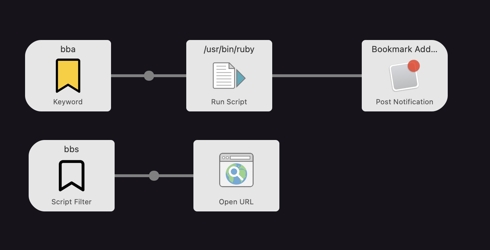

# alfred-workflow_bookmark-manager
Alfred(Mac App) Workflow - Bookmark manager using Ruby

## Description

> all ruby files in this project only for code maintenance.

create.rb -> create new bookmark
search.rb -> search bookmark by title, url

## How to Use

**Prerequisite.** Alfed app is required

1. Download release
2. unpack file
3. Double click the file

## How to Edit and Export
1. import Workflow to Alfred
2. Edit Workflow
3. Export Workflow using Alfred submenu

## Images
1. Bookmark-white: [Bookmark icons created by Dave Gandy - Flaticon](https://www.flaticon.com/free-icons/bookmark)
2. Bookmark-yellow: [Bookmark icons created by Iconpro86 - Flaticon](https://www.flaticon.com/free-icons/bookmark)

## DDL
```sql
-- auto-generated definition
create table urls
(
    url        text,
    title      text,
    desc       text,
    added_date text default (datetime('now', 'localtime'))
);

create unique index urls_url_uindex
    on urls (url);
```

## Workflow Screenshot

